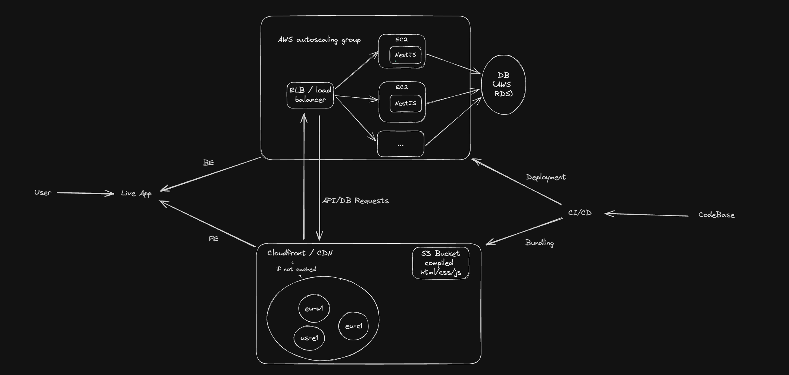

Frontend is built with React + TypeScript, and backend with NestJS.
Added a postgres db that runs with docker.

# System Design



## Overview

I decided on using AWS services to achieve an infrastructure that is relatively simple but also reliable and scalable, with the following building blocks:

-   Frontend:

    -   I choose CloudFront as a CDN to distribute & cache the content based on geolocation, stored as compiled static files in S3 buckets in a highly scalable, reliable, and secure way.

-   Backend:

    -   The base for backend are EC2 instances, running the backend API with NestJS responsible for handling API requests and interacting with the database. The instances are managed by an AWS Auto Scaling Group, which is linked to a load balancer to distribute the traffic evenly across the instances.

-   Database:

    -   Because it was a requirement to use postgres, I would suggest AWS RDS as a managed database, because it is easy to set up, operate, and scale, and it also has automatic backups.

-   Monitoring: AWS Cloudwatch to trigger alarms based on certain thresholds

## Drawbacks and limitations

-   Cost: AWS services can be expensive, especially managed ones like EC2 or RDS. Another approach could be using serverless (eg. lambda) to simplify and reduce costs. However that comes with their own setbacks like cold-starts. 
-   Vendor lock-in: In my plan I am using AWS, but similar alternatives can be found in other cloud providers eg. Azure or Google.

## Open questions

-   How much traffic are we expecting? Can we simplify the architecture? (I assumed bursts of higher traffic)
-   Are there users in multiple locations or only in Berlin? (I assumed worldwide)
-   What is the budget for infrastructure costs? What does the current solution cost?
-   Should we retain & backup data? (I assumed yes)

# Module & API Architecture

## Modules


### `supportRequest` Module

A task represents a support request that volunteer office workers can sign up for. One task can have multiple volunteers.

#### Data model - `SupportRequest`

```json
{
    "id": 1,
    "description": "Help needed with assembling internal parts for car",
    "workType": "assembly",
    "location": "Factory 2",
    "dateOfJob": "2024-03-01",
    "requiredNumOfPeople": 1,
    "createdBy": "d816e4e8-0339-4ba6-bf82-86e9c35d80e2",
    "createdAt": "2024-02-15"
}
```

### `signupEvent` Module

A sign-up event represents an office worker volunteering for a `SupportRequest`. One worker can sign up to multiple support request, but only once to the same request - the combination of userId & supportRequestId has to be unique.
Every sign-up event creates a new entry in the `signupEvent` table.

#### Data model - `SignupEvent`

```json
{
    "id": 1,
    "userId": "x816e2e8-0339-4aa6-bh82-86e9x35d80e2",
    "supportRequestId": 1,
    "status": "pending"
}
```

## API Routes

-   Support request

    -   GET `/support-requests` - Get a list of `SupportRequest` objects.
        -   Query parameters can be used according to the [data model](#data-model---supportrequest) to refine the search, eg. `?createdBy=`
    -   GET `/support-request/:id` - Get a `SupportRequest` by id
    -   POST `/support-request/create` - Create a new `SupportRequest`
        -   Request body has to be a `SupportRequest` object, except the `id` `createdBy` and `createdAt`.
    -   PUT `/support-request/:id` - Update fields of `SupportRequest` - any field of object except `id`, `createdBy` and `createdAt`
    -   DELETE `/support-request/:id` - Delete existing `SupportRequest`

-   Sign-up Event

    -   GET `/signup-events` - Retrieve all office worker sign-ups as a list of `SignupEvent` objects
        -   Query parameters can be used according to the [data model](#data-model---signupevent) to refine the search, eg. `?supportRequestId=`
    -   POST `/signup-events/create` - Sign up an office worker to a given support request
        -   Request body has to be a `SignupEvent` object, except the `id` is autogenerated
    -   PUT `/signup-event/:id` - Update `status` of `SignupEvent` - other fields not allowed
    -   DELETE `/signup-event/:id` - Delete existing `SignupEvent`

-   Middleware
    -   Authentication: check if session from the cookie external auth service is valid.
    -   Authorization: check roles based on external auth service - eg. /supportRequest/create can only be accessible to line managers (with corresponding role)

## Views

-   Public:
    -   List of Support Requests: allows everyone to view support requests posted by managers
-   Office worker:
    -   My Sign ups: allows worker to see all support requests they volunteered for
-   Line manager
    -   Add Support Request: allows the manager to create a new support request
    -   My Support Requests: detailed overview to manage existing requests created by the manager - check who signed up and signal if the worker attended or not.

# Volunteer submission implementation

How to run the implementation

Backend:
- `cd backend`
- `npm i` to install
- `npm run start:dev:db` to start up database on docker  
- `npm run start:dev` to start backend server

Frontend:
- `cd frontend`
- `npm i`
- `npm run dev` to start frontend server  

you can create a new support request:

`curl --location 'http://localhost:3000/support-request/create'
--header 'Content-Type: application/json'
--data '{
    "description": "Help needed with assembling internal parts for car",
    "workType": "assembly",
    "location": "Factory 3",
    "dateOfJob": "2024-03-01",
    "requiredNumOfPeople": 1,
    "createdBy": "a816w2c8-0339-4ba6-bh82-86a9x35d80e2",
    "createdAt": "2024-02-15"
}'`

Then, using the frontend you are going to be able to subscribe to the task created. The same user can subscribe only once to the same support request.

## Thought process

When I received this task, I started to create some drafts on paper, which you can see [here](./thoughtprocess/) if you are interested in my thought process. Please be aware that some of the specifications changed during review & implementation.


## Backlog

- Users should only be able to apply to support request that was not created by them
- Frontend and backend should also follow and restrict how many users already subscribed and not let more people subscribe than required by the support request
- Dockerize frontend & backend


## Extensibility

-   Email communication - create subscription possibility for receiving additional info about support requests
-   More extensive sorting & filtering - eg. based on request creation date
-   Add notes & notifications, eg. if no-one signed up yet, or when someon signed-up
-   Mapping work types & factory locations in a separate table for easy maintenance
-   Feedback system for improving volunteer experience
